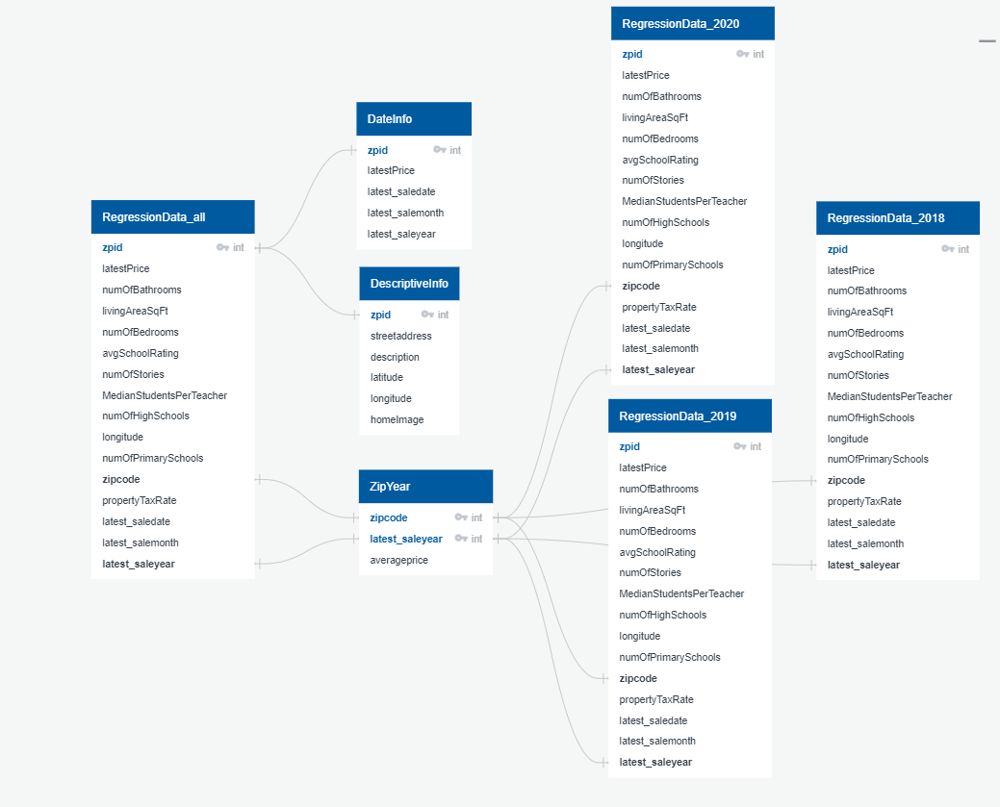
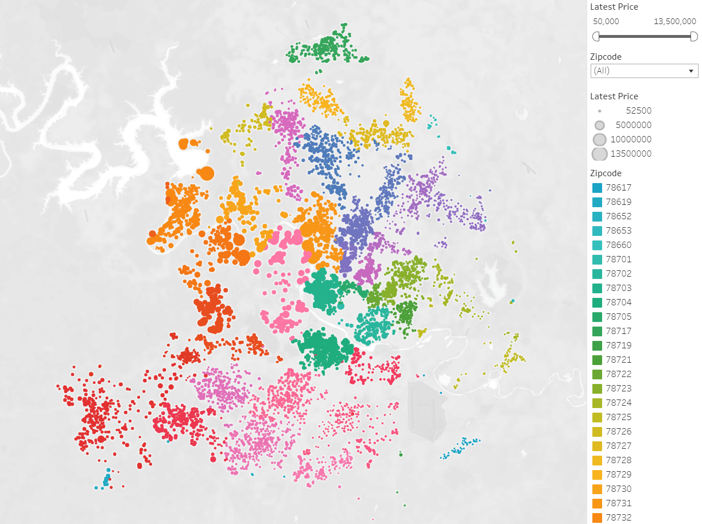
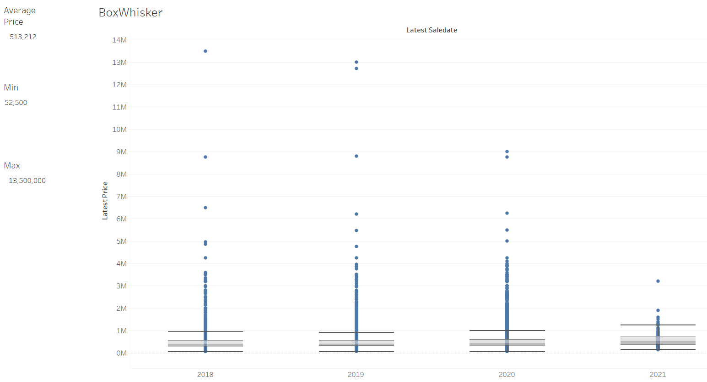
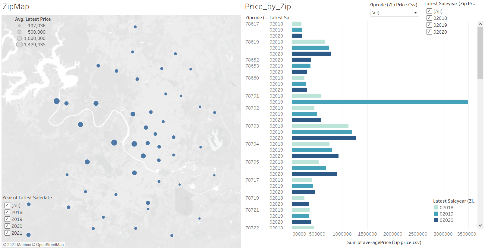

# Housing Market Analysis

Team Members: Danny, Katelyn, Robert, Carlos

## Project Outline

The purpose of this project is to use machine learning to help predict housing prices. For this analysis we used a dataset from Kaggle which is data from Jan2018-Jan2021 of Austin area housing prices. We did a preliminary analysis to determine which features were most related to the housing price. This included running a correlation matrix and feature importance. Once the dataset was cleaned and reduced to only include the most relevant features, we also calculated data of average price by zipcode and year. This was joined to the data in SQL. Finally, the cleaned data was analyzed using xgboost machine learning method.

A presentation of the project is found here: https://docs.google.com/presentation/d/1cHTK7ICnjErINvytlLyeinshPlcZuPRem8DGJiTisXk/edit?usp=sharing

## Machine Learning: 
1. Data pre-processing: In order to clean the data, some text heavy fields were removed such as the address and description. The remaining fields were updated so they were all numberic. Boolean values were converted to 0/1 and get dummies was used to convert other text fields to numberic. This is all included in the cleaning data notebook ([CleaningData](notebook/CleaningData.ipynb)) and google slides. 
2. Feature selection: Some features were eliminated since only a handful of houses had them. After this preliminary cleaning, we used correlation matrix to pick the 5 features with most positive, and 5 features with the most negative correlation to price. An initial xgboost analysis was run with the full data set, and we pulled some of the top features based on feature importance. This is all included in the cleaning data notebook ([CleaningData](notebook/CleaningData.ipynb)) and google slides. 
3. Training/splitting data: Two methods were investigated for training the data. One is to use the built in random splitting features. The second method was first splitting the data by year, then training for one year, and testing on the subsequent year. Using one year to train for the next decreased accuracy scores, so we used the built in random splitting feaure for training.
4. Model choice: Linear regression, Random Forest, and xgboost were the three models tested in this analysis. xgboost had the highest accuracy score of the models tested. See Google slides for additional details.
5. Changes of model choice: xgboost was the final method selected.
6. Training/future training: Splitting the data by year did increase the accuracy score compared to all the data combined.
7. Current accuracy score: 
* 2018: Mean absolute error of 92,070 ([xgboost_optimization_2018](notebook/xgboost_optimization_2018.ipynb))
* 2019: Mean absolute error of 88,289 ([xgboost_optimization_2019](notebook/xgboost_optimization_2019.ipynb))
* 2020: Mean absolute error of 104,758 ([xgboost_optimization_2020](notebook/xgboost_optimization_2020.ipynb))

## Database:
1. Cleaning data file pushes cleaned tables into pgAdmin ([CleaningData](notebook/CleaningData.ipynb))
2. Joined tables are then pulled out of pgAdmin ([PullFromPGAdmin](notebook/PullFromPGAdmin.ipynb))
3. Database has 7 tables from the original data
4. Joins are used to add zip code based prices to the cleaned data set, this adds an additional 4 tables. ([AustinHousing_Joins](SQL/AustinHousing_Joins.sql)) 
5. SQLAlchemy is used for connecting pgAdmin in the jupyter notebook files
6. ERD 

## Dashboard: 
The Tableau Dashboard is available here: https://public.tableau.com/shared/WZQN84F3C?:display_count=n&:origin=viz_share_link

1. The two images below show a map of the original housing price data and basic pricing information.

2. The image below shows the data calculated in the analysis. Pricing by zipcode and year

3. In Tableau, the map include pop-up details of the address and home description. The other charts allow filtering. 

